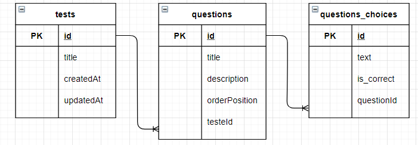

# Backend Developer Junior Challenge  
##### Desafio para o processo seletivo da Gama Academy  

[](https://opensource.org/licenses/MIT)

## Como rodar o projeto

Baixe o projeto do repositorio ou clone:  

```sh
git clone https://github.com/sampaiorafael/challenge-gamaacademy.git
```  

Instale as dependencias necessárias:  

```sh
npm install / npm install --include dev
```

Certifique-se de criar a variavel de ambiente necessárias (.env.production) conforme o .env.example e possuir o database correspondente no seu SGBD

Mude a última linha do .env.production conforme 
```TYPEORM_ENTITIES = dist/src/entities/**/*.js```

Compile o typescript

```sh
npm run build
```

Inicie o servidor

```sh
npm run start
```

Visite a rota /status, direto do navegador, para verificar o servidor

## Rotas :arrows_counterclockwise:

- GET /status
    - Descrição: Exibe status atual do servidor  
- POST /test
    - Descrição: Cria uma prova, suas questões e alternativas  
    - Requisitos: Objeto JSON no formato adequado
- GET /test/id
    - Descrição: Devolve uma prova criada anteriormente
    - Requisitos: ID da prova (não das questões ou alternativas)

>Exemplo de JSON para criação de uma prova completa (com questões e alternativas)


<details>
<summary>Exemplo</summary>
<pre>
{
        "title": "Prova de matematica",
        "questions": [
            {
                "title": "Resolva a soma",
                "description": "4 + 4",
                "orderPosition": 1,
                "choices": [
                    {
                        "text": "7",
                        "isCorrect": 0
                    },
                    {
                        "text": "8",
                        "isCorrect": 1
                    },
                    {
                        "text": "12",
                        "isCorrect": 0
                    }
                ]
            },
            {
                "title": "Assinale a quantidade correta",
                "description": "JC comprou 5 frutas e comeu 3, quantas restam?",
                "orderPosition": 2,
                "choices": [
                    {
                        "text": "3",
                        "isCorrect": 0
                    },
                    {
                        "text": "8",
                        "isCorrect": 0
                    },
                    {
                        "text": "2",
                        "isCorrect": 1
                    }
                ]
            },
            {
                "title": "Determine a idade de Ricardo?",
                "description": "Sabendo que Ricardo tem metade da idade de seu irmao que tem 40 anos",
                "orderPosition": 2,
                "choices": [
                    {
                        "text": "20",
                        "isCorrect": 1
                    },
                    {
                        "text": "80",
                        "isCorrect": 0
                    },
                    {
                        "text": "60",
                        "isCorrect": 0
                    }
                ]
            }
        ]
}
</pre>
</details>

## Tecnologias :dart:

- TypeScript
- Express
- MySQL
- TypeORM
- Joi
- Mocha & Chai 

## Arquitetura :triangular_ruler:

### Camadas

- Routes
- Controllers
- Validation
- Services
- Repositories
- Types
- TDD

### Orientações 

Todo código, dentro do possível foi escrito buscando respeitar conceitos como: 

- Clean Clode
- DRY
- POO
- Single Responsibility
- REST

Visando organização, padronização e por consequência, legibilidade e facilidade de manutenção posterior.

### SGBD

A modelagem de dados foi criada a partir dos cconceitos de relacionamento entre as entidades, buscando utilizar o poder do mapeando relacional tanto por parte do código com TypeORM como por estar utilizando um banco de dados relacional.




### Testes

O sistema, incluindo as rotas, está coberto por testes unitário para garantir segurança e melhor integridade do código a cada feature

- Teste da Rota GET /status
- Teste da Rota POST /test
- Teste da Rota GET /test/id

> Os testes necessitam do SGBD para simular o ambiente de produção real, certifique-se de que ele está ativo, e tome cuidado, pois os testes que utilizam o SGBD o limpam apos o teste.

## Scripts :bookmark_tabs:

- `build` - Compila o TypeScript
- `start` - Inicia o servidor
- `test` - Roda os testes unitários
- `test:dev` - Roda os testes unitários em watch mode
- `start:dev` - Inicia o servidor em watch mode

> Scripts com sufixo `:dev` são para otimizar a produtividade em desenvolvimento, não é recomendado seu uso para produção.

## Git Flow :octocat:

Prefixos bem estabelecidos em commits bem feitos com proposíto de assegurar um versionamento seguro do projeto e leitura compreensível do processo de desenvolvimento

- doc: Relacionado a documentação do projeto  
- pkg: Relacionado a configurações do pacote (scripts, bibliotecas, etc...)
- refac: Refatoração de código
- feat: Nova funcionalidade
- tsconfig: Relacionaso as configurações do TypeScript
